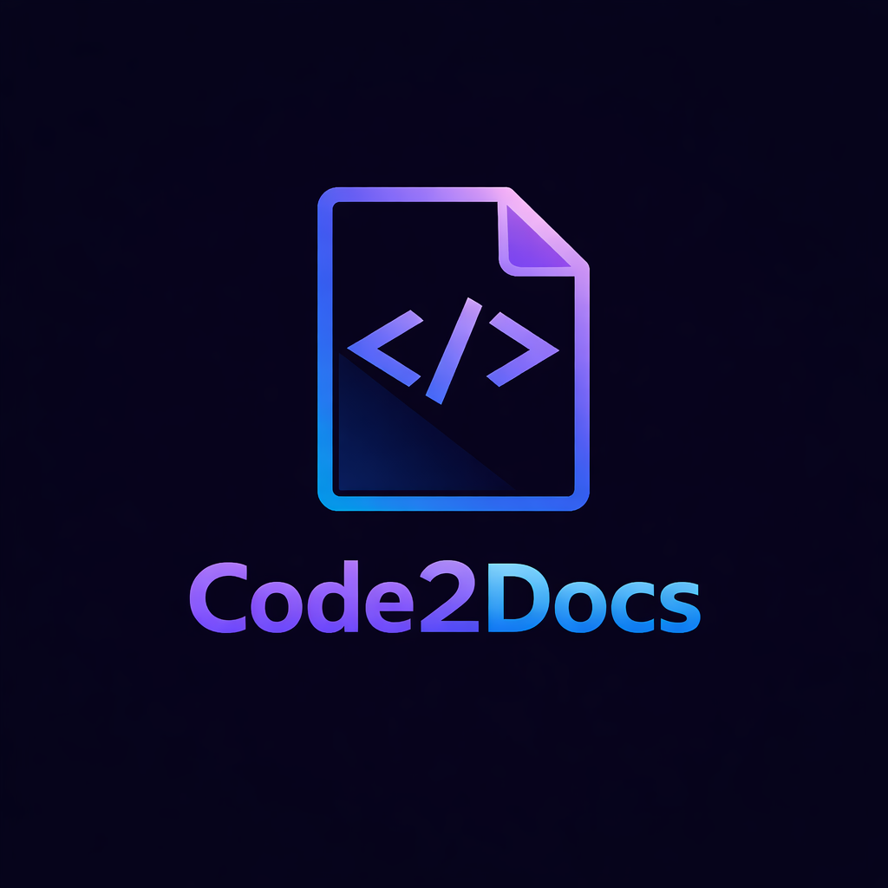
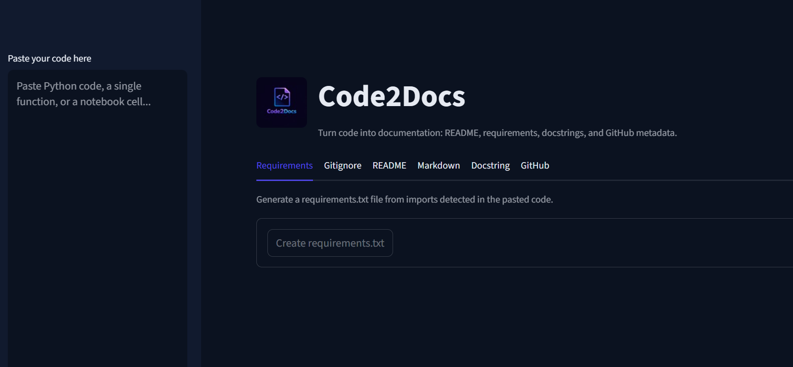
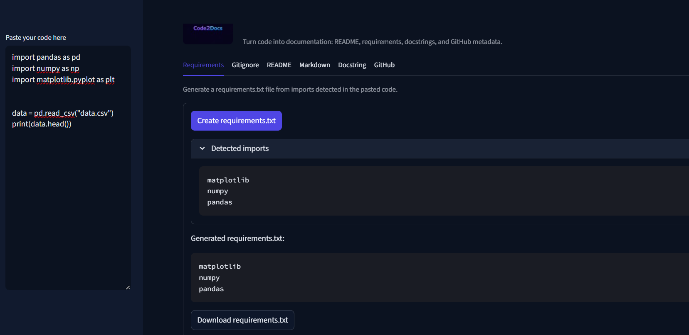
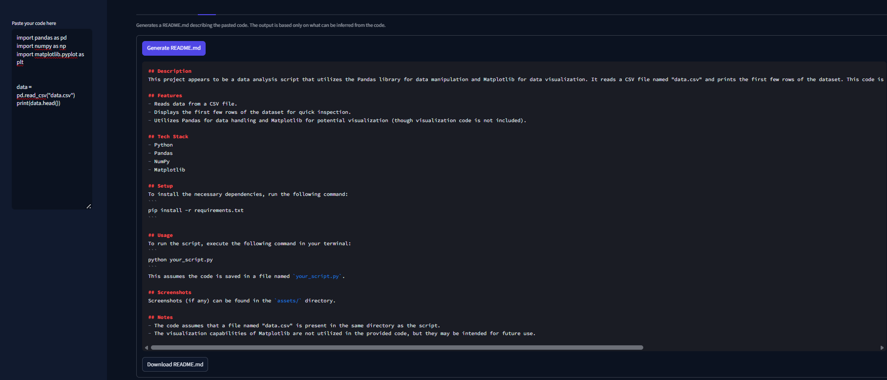
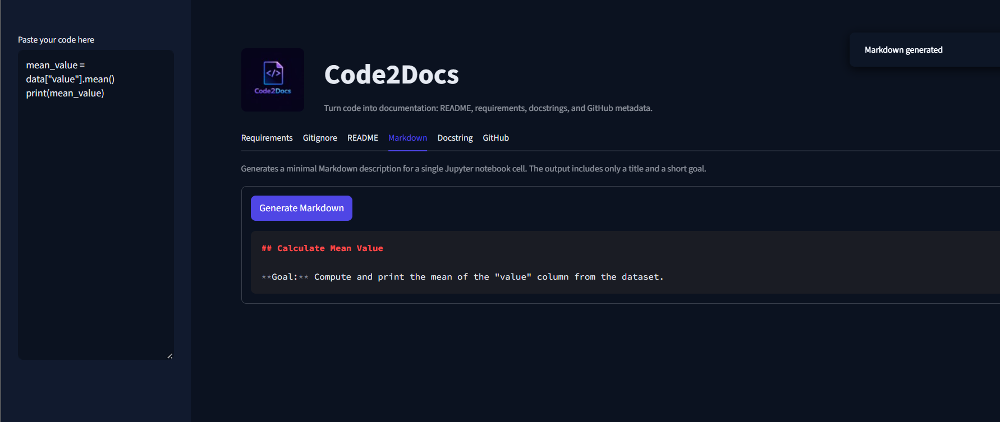
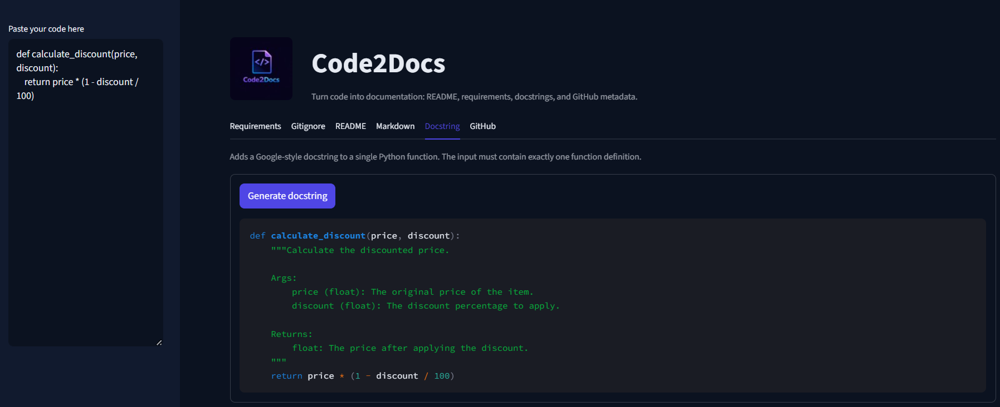
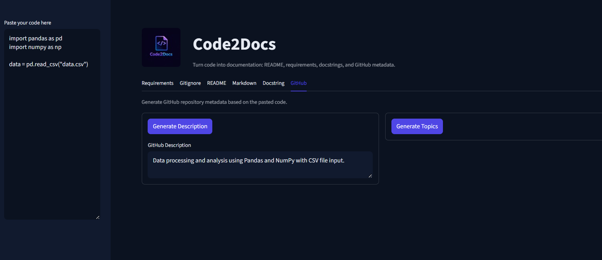
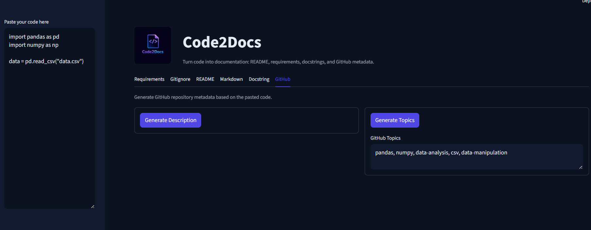
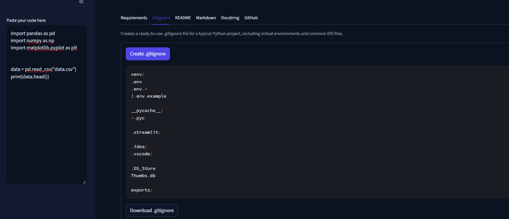

# Code2Docs

Code2Docs is a Streamlit-based tool that helps developers generate documentation artifacts directly from Python code or Jupyter notebook cells.

The application allows you to paste code once and generate README files, requirements, docstrings, notebook markdown cells, and GitHub metadata in a clean and structured way.

---

## Features

- Generate `requirements.txt` based on detected imports
- Create a ready-to-use `.gitignore` for Python projects
- Generate a complete `README.md` based on the provided code
- Add Google-style docstrings to Python functions
- Generate minimal Markdown descriptions for Jupyter notebook cells
- Create GitHub repository descriptions and topics (tags)

---

## Tech Stack

- Python
- Streamlit
- OpenAI API
- dotenv

---

## Setup

Install the required dependencies:

pip install -r requirements.txt

Create a .env file based on .env_example and add your API key.

## Usage

Run the application:

streamlit run app.py

Paste your Python code or a single Jupyter notebook cell into the input field.

Use the tabs to generate the desired documentation artifact:

Requirements

Gitignore

README

Markdown

Docstring

GitHub metadata

Copy or download the generated output and add it to your project.

## Screenshots
# Application overview

# Generating requirements.txt

# README generation

# Notebook Markdown generation

# Docstring generation

# GitHub description and topics

# .gitignore generator

# Notes

The generated documentation is based only on the provided code.

If the input is ambiguous or minimal, outputs may be more generic.

For docstring generation, the input must contain exactly one Python function.
